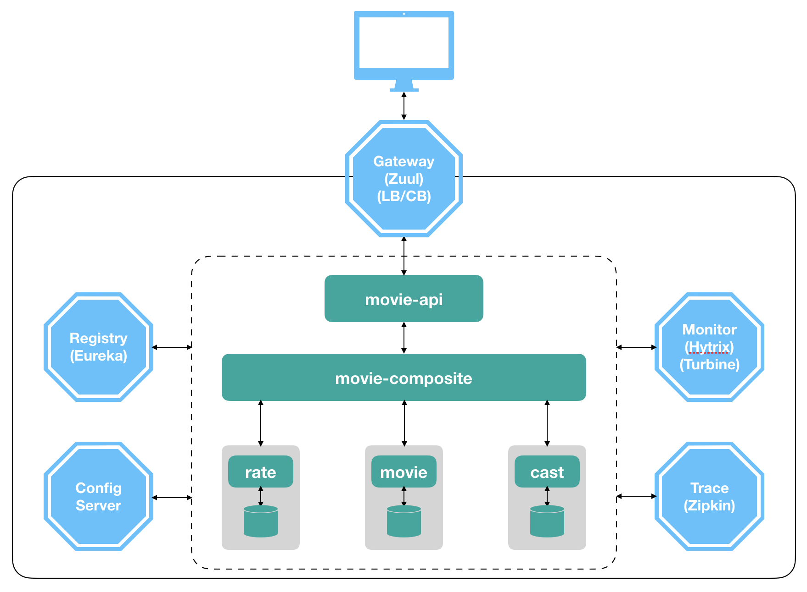

# A Simple Tutorial of Spring Cloud 

[中文版](doc/README-CN.md)

A tutorial series help your understand how to make a [Microservice](https://github.com/xulinhao/study-resource/blob/master/devops/MS.md) application with 
[Spring Cloud](https://projects.spring.io/spring-cloud/) step-by-step.

Hm..., let us make a movie application that is composed of three services: 
*movie*, *cast* and *rate*, and we also assume that each service has its own 
database. When a user looks for the detailed information of a movie, the results of all three services will be combined and returned finally. 

Bellow is the technical landscape of this tutorial and all Spring Cloud 
components we used are also included. In this tutorial, we will add all these components one-by-one to achieve our final goal: a complete 
microservice application.

Enjoy your study!

## [Part 1: Dockerizing a Eureka Server](doc/part-1.md)

## [Part 2: Using Eureka, Ribbon, Feign and Zuul](doc/part-2.md)

## [Part 3: Trying out Circuit Breaker, Hytrix and Turbine](doc/part-3.md)

## [Part 4: Tracing with Zipkin and Sleuth](doc/part-4.md)

## [Part 5: Adding a Config Server](doc/part-5.md)

## [Part 6: Logging with ELK](doc/part-6.md)