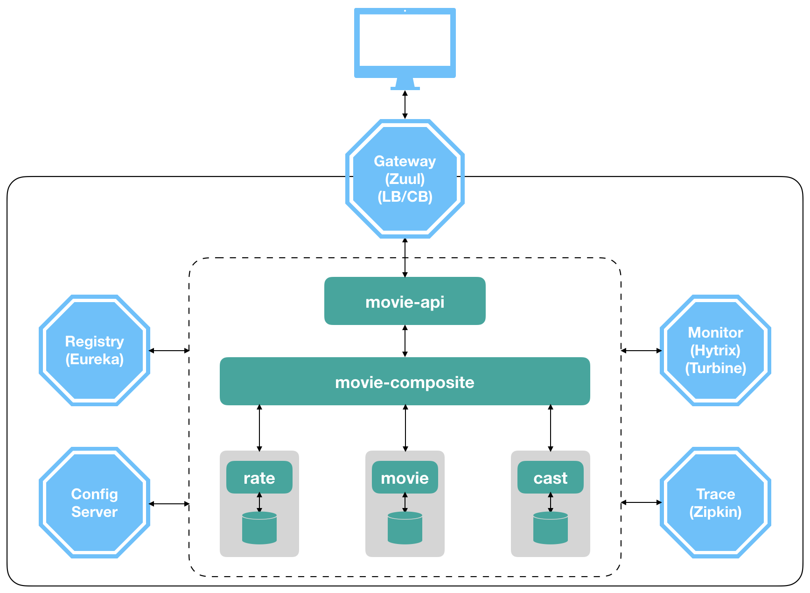

# 微服务技术入门

[English](../README.md)

本教程旨在帮助大家理解什么是[微服务应用](https://github.com/xulinhao/study-resource/blob/master/devops/MS.md)，以及如何通过实际代码和实验搭建一个基于 [Spring Cloud](https://projects.spring.io/spring-cloud/) 技术的微服务系统。

在开启我们的学习之旅之前，假设我们要构建一个帮助用户查询电影信息的微服务系统；当查询一个电影的时候，该系统通过三个基本服务分别返回电影名称
(*movie*)，演员表
(*cast*)和评分(*rate*)，最后系统将这三部分信息进行组合(*movie-composite*)并返回给最终用户。

在本教程中，我们将逐步添加微服务组件，最终完成一个典型的微服务系统（如下图所示）。

希望有所收获！

## [第一步: 做一个注册服务器](part-1-cn.md)

## [第二步: 使用服务注册访问和负载均衡](part-2-cn.md)

## [第三步: 试试熔断器与服务监控](part-3-cn.md)

## [第四步: 增加全局配置服务](part-4-cn.md)

## [第五步: 追踪并肢解服务请求](part-5-cn.md)

## [第六步: 管理服务日志](part-6-cn.md)

